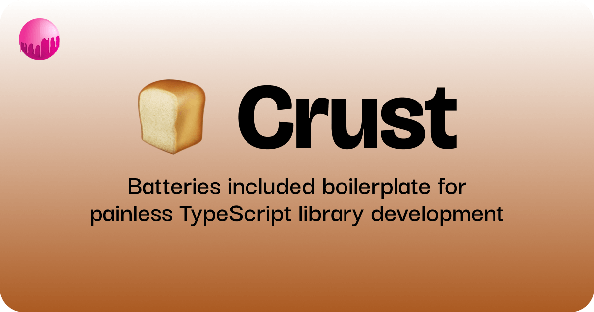

# 🍞 Crust

TypeScript library boilerplate with Vite, Release-It, and GitHub Actions • by the [sassywares](https://sassywares.com) team.

## Table of Contents

- [Features](#features)
  - [Vite](#vite)
  - [Release-It](#release-it)
  - [GitHub Actions](#github-actions)
- [Getting Started](#getting-started)
  - [Where to write code](#where-to-write-code)
  - [How to publish the library](#how-to-publish-the-library)
  - [How to install the library](#how-to-install-the-library)
- [Philosophy](#philosophy)
- [Roadmap](#roadmap)

## Features

Crust comes with all you need to instantly ship a TypeScript library, no more reinventing the wheel.

### [Vite](https://vitejs.dev)

Vite comes with a library mode, which allows you to export a standalone version of your app that can be published to NPM and used by consumers without any additional configuration. This is enabled in Crust already, in the `vite.config.ts` file.

```ts
export default defineConfig({
  build: {
    lib: {
      name: "Crust",
      entry: resolve(__dirname, "src/index.ts"),
      fileName: "index",
    },
  },
});
```

With this, just a simple `pnpm build` will build and output the library to the `dist` directory. An additional plugin named `vite-plugin-dts` is used to generate the TypeScript declaration files, which are also output to the `dist` directory. This allows your consumers to actually infer the types of the library, which is the whole point of TypeScript.

### [Release-It](https://github.com/release-it/release-it)

Release-It is a really cool tool that helps you automate the semver versioning of your library. It's configured in the `.release-it.json` file with an additional plugin named `release-it-pnpm` which allows working with pnpm a breeze, and it's used to generate the changelog, bump the version, create a GitHub release, and publish the library to NPM.

### GitHub Actions

An action is setup in the `.github/workflows/release.yml` file to build and publish the library to NPM whenever you want to release a new version. Right now, the action is set to run on `workflow_dispatch` which means you can manually trigger it from the GitHub UI, but you can change it to run on a schedule if you want.

For instance, if you want to release on each push to the `main` branch, you can:

```yaml
on:
  push:
    branches:
      - main
```

Or if you want to release on each new tag, you can:

```yaml
on:
  release:
    types:
      - created
```

You can learn more about the GitHub Actions workflow syntax [here](https://docs.github.com/en/actions/writing-workflows/workflow-syntax-for-github-actions).

## Getting started

Clone the repo or use it as a template to create your own. Then, follow the instructions below to get started.

Install the dependencies:

```bash
pnpm install
```

Start the development server:

```bash
pnpm dev
```

Build the app:

```bash
pnpm build
```

Release a new version and publish to NPM:

```bash
pnpm release
```

### Where to write code

Your library's code goes inside the `src/lib` directory. Each module you want available to the consumers should be exported from the `src/index.ts` file. This allows you to granularly export what you want, and what you don't.

### How to publish the library

Crust provides you 2 ways to publish the library to NPM:

1. `pnpm release`

This will build the library, generate the changelog, bump the version, create a GitHub release, and publish the library to NPM. Note that this will fail if you aren't signed in to NPM in your terminal session. This is good for when you're the only one working on the library.

2. `GitHub Actions`

From the GitHub Actions UI, you can trigger the `Release` workflow, which will do all that's listed above. Only catch here is that you need to first add a token from NPM with write-access to the repository secrets. The token name must match the one specified as the `NODE_AUTH_TOKEN` in the workflow file. A sophisticated guide on how to add a token to the repository secrets can be found [here](https://docs.github.com/en/actions/security-for-github-actions/security-guides/using-secrets-in-github-actions).

### How to install the library

Once published to NPM, you can install the library in your project by the basic `pnpm add` command. For example, if you published the library to NPM as `@sassywares/crust`, you can install it in your project by running:

```bash
pnpm add @sassywares/crust
```

And then use in your project:

```ts
import { sum } from "@sassywares/crust";

console.log(sum(1, 2));
```

`sum` will be typed as well since we're exporting the declaration files using the `vite-plugin-dts` plugin.

## Philosophy

The reason why I made Crust was because I like re-using the code I write, because I don't like reinventing the wheel. Maybe you're building a multi-repo app that has to re-use something, use crust and ship that something as a standalone library. Maybe you just want to make something useful available to everyone with a single command, Crust has you covered.

## Roadmap

Here's what's planned for future releases:

- [ ] Add testing setup with Vitest
- [ ] Add more test examples and testing utilities
- [ ] Add automated code quality checks (code coverage, complexity analysis)
- [ ] Create templates for different types of libraries (React components, Node.js utilities, etc.)

You made it to the end? Mad props 🤘

If you have any ideas or suggestions, please let me know. This is an open-source project and all contributions are welcome. You can reach out to me on [LinkedIn](https://www.linkedin.com/in/kayshawn/) or my [email](mailto:kay@sassywares.com).
